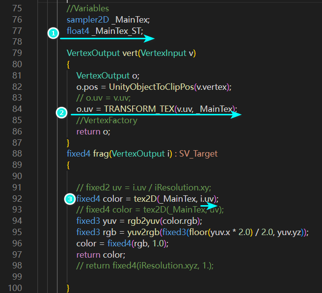
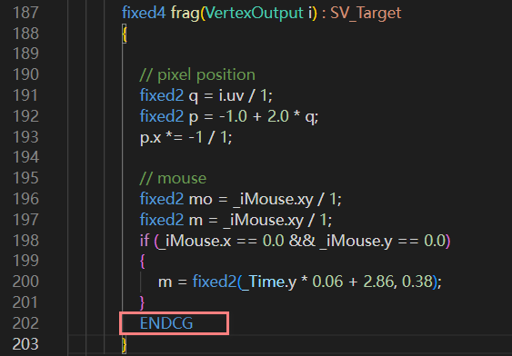
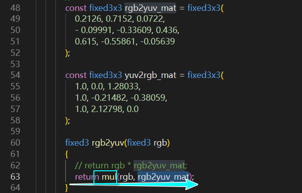

# Bug/Error 
- [x] **一定会出现** 会将```iResolution```转换为1，这将直接导致错误
  - 方法1： 在变量区加上```uniform vec3 iResolution; ```，这种方法有时候会导致其它问题
  - 推荐方法：uv处理时使用```TRANSFORM_TEX```代替```uv/iResolution.xy.```png
    1. 需要在变量区引入``` float4 _MainTex_ST;```
    2. 在顶点着色器就对uv进行处理
    3. 在片元着色器直接使用uv
    - 

- [ ] **一定会出现** 将OpenGL的```Texture```转换为HLSL的```tex2Dlod```方法时出错，因为[TextureLod](https://registry.khronos.org/OpenGL-Refpages/gl4/html/textureLod.xhtml)是3个参数，而[tex2Dlod](https://learn.microsoft.com/en-us/windows/win32/direct3dhlsl/dx-graphics-hlsl-tex2dlod)是2个参数

- [x] **偶尔出现** 会缺失```}```
  - 这好办，Unity会直接提示语法错误，加上就可以了

- [x] **偶尔出现** 将```MainImage```转换为片元着色器时，可以没有```return```,因为ShaderToy的```MainImage```的最后一行一般是```fragColor = vec4()``` 
- [x]  可能会出现重复生成的情况，比如```fixed3 init = fixed3(sin(time * .0032, sin(time * .0032, sin(time * .0032) * .3, .35 - cos(time * .005) * .3, time * 0.002);```中重复生成了```sin(time * .0032```
- [x]  ```END CG```位置可能出现错误，放在了函数里面 
- 
  - 解决办法：
    - 一般手动下移一行即可
    - 并且要注意一般会在代码末尾少一个```}```


- [x] **一定会出现** 需要使用mul代替向量直接乘以矩阵
- 

- 案例 少括号 小数点变成了逗号 不允许向量直接减去数字
  
  - **频繁出现** <font color="00ffff">少括号</font> 
  - **偶尔出现** <font color="00ff00">小数点变成了逗号</font>  这个```.```是如何被错误的转换为```,```，着实无法理解
  - **绝对会出现** <font color="ffff00">不允许向量直接减去数字</font> ，在GLSL中是允许这样操作的，但是Unity/HLSL是不支持的

# 语法问题
- [x] 初始化数组时不允许 ```fixed3 f = {.1}```
  ```c
  float lig = 0.5 + dot(nor, float3(0.7, 0.2, -0.7));
  // col = float3(lig);//不允许用一个值来初始化所有值，不严谨！

  col = float3(lig, lig, lig);//必须明确指定每一个值
  ```


